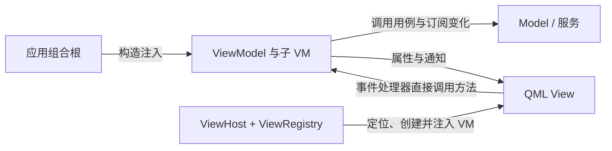

# Caliburn.Micro.Qt

受 **Caliburn.Micro** 启发，面向 **Qt Quick / QML 与 C++** 的 MVVM 支撑框架。

> 当前状态：第三批已实现并在 macOS arm64 / Qt 6.8.3 验收通过，提供 ViewModelBase、ScreenViewModel、ViewRegistry 与 ViewHost。Shell 保持根窗口，Home 承接计数、参数按钮及键盘输入；Shell 展示两者的生命周期状态。独立构建、CTest、qmllint、仅框架构建、Cocoa 集成测试及实际窗口操作均通过。后续 IoC 装配调整也已通过本机验收，见 [记录](docs/IoC装配验收记录.md)。现已补充泛型单项 Conductor 核心与自动测试；第四批示例导航尚未完成，Collection.OneActive 下一轮实现，第五、六批未实施，麒麟待验证。

这是一个独立项目。名称表达对 [Caliburn.Micro](https://caliburnmicro.com/) 的架构借鉴，不代表官方移植、官方关联或完整 API 对等，也不引入 .NET 版 CM 库。

## 为什么创建这个项目

WPF 与 Caliburn.Micro 提供了一组相互配合的概念：属性通知、Screen 生命周期、Conductor 组合、视图定位、操作与守卫，以及窗口管理。开发者可以围绕 ViewModel 组织界面，而不用在每个页面重复处理这些连接。

Qt 已有属性绑定、信号、元对象系统和动态加载等基础机制，第三方也有 [QtMvvm](https://github.com/Skycoder42/QtMvvm) 等 MVVM 项目。项目动机并不是“Qt 完全没有 MVVM 框架”，而是希望为 Qt Quick 建立一套以 CM 风格为核心、边界明确、可验证的组合约定。

我们希望减少这些重复工作：父 View 转发子组件的一组属性和信号，页面与业务对象的生命周期连接，页面切换混入业务状态判断，以及创建对象时底层依赖沿父子 VM 构造链传播。

这里的“严格遵循 MVVM”指本项目的设计约定。目前没有自动强制检查架构的能力；是否遵守这些边界，仍需要应用设计、代码评审和后续测试共同保证。

## 架构原则

- **View 绑定单个、明确类型的 VM**：业务 View 声明 `required property XxxViewModel viewModel`，通过属性读取、通知和操作表达交互。纯样式、按钮和 delegate 不必拥有独立业务 VM。
- **Model 与服务保存业务事实和规则**：VM 组织展示、操作意图及交互流程，页面激活状态不能代替业务会话状态。
- **VM 不持有控件**：VM 不保存 QML Item、按钮或窗口引用；焦点、键盘事件和布局留在 View 与通用视觉组件中。
- **父 VM 组合子 VM**：父对象接收所需子对象及自己直接使用的服务，不替子对象转交全部底层依赖。View 通过子 VM 属性嵌套装配。
- **组合根负责创建**：应用集中装配服务和 VM 树；需要按需创建时由应用提供类型化工厂，业务 VM 不访问容器或服务定位器。
- **所有权与生命周期分别明确**：C++ 持有 VM 树，QML 持有 View 树；View 先于其借用的 VM 销毁。装载或卸载 View 不隐式开始业务，也不隐式删除 VM。
- **操作显式绑定**：View 手写 enabled 与事件处理器，直接读取 VM 的可用状态并调用方法。VM 和业务用例各自检查职责内的前置条件，按钮禁用只是展示结果。

目标数据与操作路径：



## 与 Caliburn.Micro 的概念对应

这是职责上的借鉴，不能理解成接口一一移植。

| Caliburn.Micro 概念 | Qt 目标类型或方案 | 初始约定 |
| --- | --- | --- |
| PropertyChangedBase | ViewModelBase + QObject 属性系统 | 派生 VM 声明 Q_PROPERTY / NOTIFY，基类提供类型化 setAndNotify；不提供字符串通知入口。 |
| Screen | ScreenViewModel | 初始化一次，激活与普通停用幂等；已初始化对象每次关闭都执行钩子，生命周期接口由 C++ 管理。 |
| Conductor<T> | Conductor<T> + ConductorViewModelBase | 已实现泛型单项导航；切换关闭旧项并延迟释放。Collection.OneActive 下一轮实现。 |
| ViewLocator / ViewModelBinder | ViewRegistry、ViewHost | 按应用提供的 VM 类型映射定位 View，创建前注入 viewModel。 |
| ActionMessage / CanXxx | QML 原生属性绑定与事件处理器 | 1.0 不移植动作组件；显式绑定 enabled 并调用具体 VM，方法自身检查业务条件。 |
| WindowManager 的部分职责 | IDialogService、DialogService、DialogHost | 第五批加入单个模态确认弹窗和异步结果，不包含通用多窗口管理。 |
| IoC / 构造注入 | 应用组合根 + Boost.Ext.DI v1.3.2 | 创建与长期持有分开，框架 VM 不依赖容器。 |
| Bootstrapper | BootstrapperBase + AppBootstrapper | Configure 配置映射和根工厂，OnStartup 显示根窗口，Run 统一生命周期与清理。 |

## 类型清单与实现状态

这是六批迭代的完整目标清单；“拥有”表示所有权契约。当前已实现 ViewModelBase、ScreenViewModel、ViewRegistry、ViewHost、BootstrapperBase 和泛型单项 Conductor；集合型 Conductor 与弹窗类型待后续实现，详见 [迭代实现计划](docs/迭代实现计划.md)。

| 类型 | 形态 | 职责 |
| --- | --- | --- |
| ViewModelBase | C++ QObject 基类 | 提供共同类型及 protected setAndNotify，不新增业务属性、状态或信号；完整成员见专题。 |
| ScreenViewModel | C++ VM 基类 | 管理初始化、激活、停用及 isInitialized / isActive 通知。 |
| ConductorViewModelBase / Conductor<T> | C++ Screen 子类与模板层 | 接管唯一当前 VM，Screen 子类执行生命周期；切换关闭旧项并 deleteLater。 |
| ViewRegistry | C++，向 QML 提供单例入口 | 按应用登记的 VM 类型查询 QML View 地址，不拥有 VM。 |
| ViewHost | QML 组件 | 使用 Loader 定位和加载 View，并注入唯一 viewModel 属性。 |
| BootstrapperBase | C++ 应用启动基类 | 编排配置、根对象创建、窗口加载、生命周期及退出清理，不依赖 DI 库。 |
| IDialogService | C++ QObject 接口 | 声明确认请求、当前弹窗、忙状态及按请求者取消的契约。 |
| DialogService | C++ 服务 | 拥有临时确认 VM，管理单次结果、异步回调和请求失效。 |
| DialogHost | QML 组件 | 显示当前弹窗，处理模态隔离、关闭和焦点恢复。 |
| ConfirmActionViewModel | C++ Screen 子类 | 提供确认文案、accept / cancel 操作与一次完成结果。 |
| ConfirmActionView | QML View | 展示确认 VM，通过手写事件处理器调用接受或取消方法。 |

配套值类型 **ConfirmationRequest** 保存 `title`、`message`、`confirmText`、`cancelText`，不保存业务操作枚举、控件或 VM 引用。

ViewModelBase 的新增成员仅为构造函数、默认虚析构和 protected 模板辅助 `setAndNotify(field, value, &Owner::notifySignal)`。同值不通知，更新先赋值再同步通知；空信号或对象类型不兼容时诊断并拒绝修改。它没有 displayName、字符串通知入口或生命周期状态；QObject 的继承成员继续可用。完整接口、QML 注册与所有权约定见 [ViewModelBase](docs/ViewModelBase.md)。

已实现的 Screen 生命周期见 [ScreenViewModel](docs/ScreenViewModel.md)：关闭后可重激活，初始化仍只执行一次；关闭条件与 CM 一致，未初始化时跳过关闭，已初始化时重复关闭仍执行钩子。Screen 与 Conductor 不维护转换标记或拒绝重入，由调用方保证在应用主线程操作。单项 `Conductor<T>` 沿用此生命周期接口，通过 `activateItem(std::unique_ptr<U>&&)` 接管当前项。切换先更新 activeItem 并通知，再关闭旧 Screen、按父状态激活新项，最后对旧项安排 deleteLater；`closeItem(T*)` 只关闭当前项。已初始化的父 Conductor 关闭时也清空选择、关闭当前子项并延迟删除；未初始化时关闭无操作，保留当前项及所有权。普通停用保留选择，父对象关闭后重新激活需要创建新页面。本轮没有关闭守卫或 Items 集合；详情与 CM 差异见 [Conductor](docs/Conductor.md)。

接管子 VM 时验证非空、没有既有 QObject 父对象、处于同一 GUI 线程；设置父对象成功后释放临时 unique_ptr。父对象的成员指针用于访问，不能再与 QObject 父树同时负责删除。

第五批的弹窗初始实现只允许一个当前请求，忙时拒绝新请求。完成结果异步交付，请求者销毁或显式取消后旧回调失效；视觉关闭不能重复产生完成结果。

## 模块与项目结构

当前已建立两个静态模块和独立启动程序，包含前三批需要的类型与页面。下表同时说明后续扩展方向。

| 单元 | CMake 目标 | QML URI / 版本 | 内容及进度 |
| --- | --- | --- | --- |
| 通用框架模块 | `CaliburnMicroQt`，别名 `Caliburn::MicroQt` | `Caliburn.Micro.Qt 1.0` | 已实现基类、Screen 生命周期、注册表、ViewHost 和单项 Conductor；集合型 Conductor 和弹窗按批次增加。 |
| 示例用户代码模块 | `CaliburnExampleModule` | `CaliburnExample 1.0` | 已实现 Shell 根窗口和 Home 计数页、参数按钮、键盘输入及生命周期状态；详情、业务服务和确认交互待后续批次。 |
| 示例装配库 | `CaliburnExampleComposition` | 无独立 QML URI | Boost.Ext.DI 创建 Shell/Home，设置 CppOwnership，返回根 unique_ptr。 |
| 示例启动程序 | `CaliburnExampleApp` | 无独立 QML URI | AppBootstrapper 配置映射与根工厂，框架 Bootstrapper 统一启动、根生命周期、类型化注入及有序退出。 |

框架和用户模块均采用静态库，通过 `qt_add_qml_module` 组织各自的 C++ 与 QML；应用和 QML 测试显式链接插件目标并用 Q_IMPORT_QML_PLUGIN 导入插件，静态类型注册及内嵌资源加载已验证。示例装配库采用 Boost.Ext.DI，Shell 通过构造函数接管 Home；两个 QML 模块和 VM 头文件不包含 DI。

```text
caliburn-micro-qt/
├── docs/                          # 设计文档与各批验收记录
├── modules/Caliburn/Micro/Qt/      # 已实现前三批框架能力
├── examples/minimal/              # 已实现 Shell 根窗口与 Home 计数页面
│   ├── app/                      # 示例启动与组合根
│   └── CaliburnExample/           # 用户代码模块
├── third_party/boost-di/          # 固定 v1.3.2 单头文件与许可证
├── tests/                         # 已有核心、装配与 QML 集成测试
├── CMakeLists.txt                 # 已有模块及构建选项
└── CMakePresets.json              # 已有可移植 debug 预设
```

依赖方向为“启动程序 → 应用装配库 → 用户代码模块 → 框架模块 → Qt”；装配库私有依赖 Boost.Ext.DI。第一、二批直接加载 `qrc:/qt/qml/CaliburnExample/views/ShellView.qml`，根窗口声明 `required property ShellViewModel viewModel`。第三批已加入框架通用视图注册机制，应用在加载前登记 Shell 根窗口和 Home 子页面映射，第五批再加入框架确认映射。框架不引用用户类型或业务模块。

Shell 是本项目的应用入口命名约定，与 qt-snake-lab 的入口命名保持一致。ShellViewModel 第一批继承 ViewModelBase，第三批已演进为 ScreenViewModel，第四批后续计划采用集合型 Conductor 保留常驻页面；ShellView.qml 始终是根窗口。第一、二批计数由 Shell 保存，第三批已整体移入 Home 子页面，第四批再将计数事实迁入共享业务服务。

完整目录、类型归属、模块接入及 qt-snake-lab 调整概要见 [模块与项目结构](docs/模块与项目结构.md)。该概要只规划游戏仓库的后续接入，尚未修改其结构设计。

## 技术起点与边界

| 项目 | 设计基线 |
| --- | --- |
| Qt | 6.8.3，Qt Quick / QML；已验证 macOS arm64，麒麟待验证。 |
| C++ | C++17，QObject 属性、信号与元对象系统。 |
| 构建 | CMake 3.21 及以上、Ninja、qt_add_qml_module；框架/示例用户模块为静态库。 |
| 应用装配 | 已采用 Boost.Ext.DI v1.3.2，固定源码及许可证随仓库提供，配置时校验头文件 SHA-256，构建不下载依赖。 |
| 操作与输入 | QML 显式读取可用状态并直接调用方法；第一批演示无参数，第二批演示 int 参数和原生键盘事件。框架不规定方法名、返回值或自动守卫契约。 |
| 视图映射 | 应用配置的类型到 View 映射，初始化阶段确定，不硬编码某个示例的页面数量。 |

Home 使用无参构造函数，Shell 只接收 Home 的 unique_ptr；两个业务 VM 不暴露 parent 参数。应用装配层由 DI 自动推导构造依赖，递归创建无父对象的 Home 与 Shell，无需额外构造 traits。Shell 构造函数接管 Home 并验证 QObject 父关系，再释放 Home 的临时 unique_ptr；根 unique_ptr 管理 Shell。局部注入器在 buildShell 返回时销毁，对象继续由父树持有。Bootstrapper 只调用 Shell 生命周期，Shell 的钩子显式驱动 Home；main 只创建应用并调用 Run。详见 [IoC 与应用装配](docs/IoC与应用装配.md)。

游戏专用的 Shell/Home/Game/Board 等 VM、游戏会话、设置服务和 Game 工厂属于使用应用，不是通用框架类型。1.0 不提供动作自动装配、统一执行或输入适配组件；本轮六批目标也不包含事件总线、通用多窗口系统、Qt Widgets 支持或架构自动检查工具。

## 阅读文档

- [模块与项目结构：框架、用户代码与贪吃蛇接入概要](docs/模块与项目结构.md)
- [迭代实现计划：框架与 example 同步交付](docs/迭代实现计划.md)
- [第一批验收记录：环境、测试与真实界面操作](docs/第一批验收记录.md)
- [第二批验收记录：参数、键盘与焦点](docs/第二批验收记录.md)
- [第三批验收记录：生命周期与视图装配](docs/第三批验收记录.md)
- [IoC 与应用装配：构造注入、父所有权与根生命周期](docs/IoC与应用装配.md)
- [IoC 装配验收记录](docs/IoC装配验收记录.md)
- [Bootstrapper：配置、根窗口启动与退出清理](docs/Bootstrapper.md)
- [Conductor<T>：泛型单项导航](docs/Conductor.md)
- [Conductor 核心验收记录](docs/Conductor核心验收记录.md)
- [ScreenViewModel：同步生命周期](docs/ScreenViewModel.md)
- [ViewModelBase：类型基础、完整成员与通知辅助](docs/ViewModelBase.md)
- [ViewHost：视图定位、动态加载与所有权](docs/ViewHost.md)
- [操作与输入绑定：显式条件、方法调用与键盘事件](docs/操作与输入绑定.md)

设计起点来自 [qt-snake-lab](https://github.com/soapgu/qt-snake-lab) 中的 [Qt 实现方案](https://github.com/soapgu/qt-snake-lab/blob/main/docs/贪吃蛇Qt实现方案.md) 与 [源码结构设计](https://github.com/soapgu/qt-snake-lab/blob/main/docs/贪吃蛇Qt源码结构设计.md)。贪吃蛇用于解释页面、子 VM 与动态释放，是框架的使用场景，不是框架的业务边界。

## 构建、运行与测试

需要 Qt 6.8.3 及以上（仅框架需要 Core/Qml/Quick；示例与 QML 测试另需 QuickControls2，测试另需 Test）、CMake 3.21 及以上、Ninja 和支持 C++17 的编译器。将 QT_ROOT 设置为本机 Qt kit 的根目录；公共预设不包含个人路径。

```sh
export QT_ROOT="你的 Qt kit 根目录"
cmake --preset debug
cmake --build --preset debug
ctest --preset debug
cmake --build --preset debug --target all_qmllint
```

macOS 启动 `build/debug/bin/CaliburnExampleApp.app`，也可执行：

```sh
./build/debug/bin/CaliburnExampleApp.app/Contents/MacOS/CaliburnExampleApp
```

Linux 的预期入口为 `build/debug/bin/CaliburnExampleApp`，尚未在麒麟验证。CTest 的 QML 测试默认使用 offscreen/software；macOS 可额外运行 `QT_QPA_PLATFORM=cocoa ./build/debug/tests/CaliburnQmlTests`。真实窗口操作记录与离屏测试分别记录。

当前示例还支持“加 2”按钮与无修饰数字键 `2`，计数超过 3 时禁用。文本框中的数字键用于输入文字，点击空白处恢复页面焦点；长按重复事件不会增加计数。

普通按钮直接绑定 VM 的可用状态与方法，objectName 仅用于对象标识与测试：

```qml
Item {
    id: root
    required property HomeViewModel viewModel

    Button {
        objectName: "increment"
        text: root.viewModel ? root.viewModel.incrementText : "增加"
        enabled: root.viewModel !== null && root.viewModel.canIncrement
        onClicked: { if (root.viewModel) root.viewModel.increment() }
    }
    Button {
        objectName: "reset"
        text: "重置"
        enabled: root.viewModel !== null && root.viewModel.canReset
        onClicked: { if (root.viewModel) root.viewModel.reset() }
    }
}
```

片段省略 QtQuick、QtQuick.Controls 与用户模块导入。特殊目标在表达式中直接引用具体 VM；可空目标显式处理空值。属性的 NOTIFY 驱动 enabled 刷新，VM 方法自身检查条件。框架不扫描按钮、不管理 enabled、不按名称寻找方法；完整用法见 [操作与输入绑定](docs/操作与输入绑定.md)。

仅构建框架时关闭示例和测试：

```sh
cmake -S . -B build/framework-only -G Ninja -DCMAKE_PREFIX_PATH="$QT_ROOT" \
    -DCALIBURN_BUILD_EXAMPLE=OFF -DCALIBURN_BUILD_TESTS=OFF
cmake --build build/framework-only
```

当前提供源码模块接入，尚未实现安装导出包；外部消费工程和平台验证在第六批完善。静态 QML 模块的插件要求见 [Qt 官方说明](https://doc.qt.io/qt-6.8/qt-add-qml-module.html)。

## 持续集成

[GitHub Actions CI](https://github.com/soapgu/caliburn-micro-qt/actions/workflows/ci.yml) 在推送 main、向 main 提交 PR 或手动触发时运行。工作流固定 Qt 6.8.3，分别使用 Ubuntu 24.04 x64 与 macOS 15 arm64，覆盖框架和示例构建、全部 CTest、all_qmllint，以及关闭示例和测试后的仅框架构建与 QML 检查。

QML 测试使用 offscreen/software；CI 不替代 Cocoa 人工窗口操作或麒麟验收。Qt 安装缓存用于减少重复下载，测试报告及配置日志保存 7 天，可在每次运行的附件中下载。工作流文件位于 [.github/workflows/ci.yml](.github/workflows/ci.yml)。

## 当前状态与后续方向

第一批已交付框架基础和 Shell 示例，第二批增加 add(int)、canAddTwo、“加 2”按钮和数字键 2 操作。文本框优先消费输入，页面过滤自动重复；Tab / Shift+Tab 显式切换焦点并跳过禁用按钮。第二批独立目录配置与构建、CTest、qmllint、Cocoa 测试和真实示例操作均通过。详情见 [第一批验收记录](docs/第一批验收记录.md) 与 [第二批验收记录](docs/第二批验收记录.md)。第三批已实现 ScreenViewModel、ViewRegistry 与 ViewHost，计数整体迁入 Home；自动检查及实际窗口验收通过，见 [第三批验收记录](docs/第三批验收记录.md)。本轮已实现泛型单项 Conductor 核心与测试；下一轮实现 Collection.OneActive，再推进第四批的详情导航和共享业务服务。Shell/Home 示例仍保持第三批行为；麒麟与外部消费工程待验证。

后续每批同时交付框架功能、example、必要测试和验收记录，验收通过后进入下一批：

| 批次 | 框架与 example 同步目标 | 当前状态 |
| --- | --- | --- |
| 1．单页面绑定 | 基类与类型化通知辅助；Shell 单页面计数文字及按钮 enabled/onClicked 显式绑定。 | 已完成，macOS arm64 验收通过 |
| 2．参数与键盘 | Shell 同页演示 int 参数按钮与原生键盘事件，直接调用 VM，不增加框架输入组件。 | 已完成，macOS arm64 验收通过 |
| 3．生命周期与视图装配 | Screen、注册表与 ViewHost；Shell 根入口、Home 计数页面及 VM 替换。 | 已完成，macOS arm64 验收通过 |
| 4．页面组合与导航 | 单项 Conductor 核心已实现；集合型 Conductor、首页/详情导航及共享服务待继续。 | 核心自动验收通过，第四批示例导航尚未完成 |
| 5．异步确认 | Shell 根窗口承载 DialogHost；Home 重置/Detail 离开确认、取消失效与焦点。 | 未实施、未验证 |
| 6．下游接入与平台验证 | 独立消费工程、静态模块接入及 macOS/麒麟验证。 | 未实施、未验证 |

第一版只要求 ShellView 一个页面：初始文字为“已点击 0 次”，增加按钮的文字绑定 ShellViewModel 属性，按钮的 onClicked 直接调用 C++ VM；点击到 5 时禁用增加，重置后归零。第一批不引入生命周期、导航、快捷键、业务服务或弹窗。接口与验收细节见 [迭代实现计划](docs/迭代实现计划.md)。

## 参考与许可

- [Caliburn.Micro：组合与生命周期](https://caliburnmicro.com/documentation/composition)
- [Caliburn.Micro：操作与守卫](https://caliburnmicro.com/documentation/actions)
- [Caliburn.Micro：命名约定](https://caliburnmicro.com/documentation/conventions)
- [Qt：向 QML 暴露 C++ 属性与方法](https://doc.qt.io/qt-6.8/qtqml-cppintegration-exposecppattributes.html)
- [Boost.Ext.DI 文档](https://boost-ext.github.io/di/user_guide.html)与 [v1.3.2](https://github.com/boost-ext/di/releases/tag/v1.3.2)

本仓库采用 [MIT 许可](LICENSE)，版权标识为 2026 soapgu。Qt、Caliburn.Micro 与其他外部项目分别适用其自身许可。
