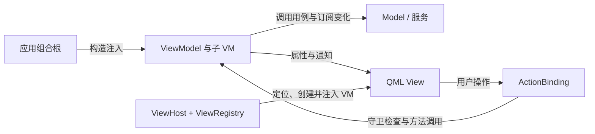

# Caliburn.Micro.Qt

受 **Caliburn.Micro** 启发，面向 **Qt Quick / QML 与 C++** 的 MVVM 支撑框架设计。

> 当前状态：初始想法与设计文档。下文列出的组件全部尚未实现，仓库没有可编译的 Qt 工程；文档代码均为设计示例。

这是一个独立项目。名称表达对 [Caliburn.Micro](https://caliburnmicro.com/) 的架构借鉴，不代表官方移植、官方关联或完整 API 对等，也不引入 .NET 版 CM 库。

## 为什么创建这个项目

WPF 与 Caliburn.Micro 提供了一组相互配合的概念：属性通知、Screen 生命周期、Conductor 组合、视图定位、操作与守卫，以及窗口管理。开发者可以围绕 ViewModel 组织界面，而不用在每个页面重复处理这些连接。

Qt 已有属性绑定、信号、元对象系统和动态加载等基础机制，第三方也有 [QtMvvm](https://github.com/Skycoder42/QtMvvm) 等 MVVM 项目。项目动机并不是“Qt 完全没有 MVVM 框架”，而是希望为 Qt Quick 建立一套以 CM 风格为核心、边界明确、可验证的组合约定。

我们希望减少这些重复工作：父 View 转发子组件的一组属性和信号，按钮各自维护可执行条件，页面切换混入业务状态判断，以及创建对象时底层依赖沿父子 VM 构造链传播。

这里的“严格遵循 MVVM”指本项目的设计约定。目前没有实现，也没有自动强制检查架构的能力；是否遵守这些边界，仍需要应用设计、代码评审和后续测试共同保证。

## 架构原则

- **View 绑定单个、明确类型的 VM**：业务 View 声明 `required property XxxViewModel viewModel`，通过属性读取、通知和操作表达交互。纯样式、按钮和 delegate 不必拥有独立业务 VM。
- **Model 与服务保存业务事实和规则**：VM 组织展示、操作意图及交互流程，页面激活状态不能代替业务会话状态。
- **VM 不持有控件**：VM 不保存 QML Item、按钮或窗口引用；焦点、键盘事件和布局留在 View 与通用视觉组件中。
- **父 VM 组合子 VM**：父对象接收所需子对象及自己直接使用的服务，不替子对象转交全部底层依赖。View 通过子 VM 属性嵌套装配。
- **组合根负责创建**：应用集中装配服务和 VM 树；需要按需创建时由应用提供类型化工厂，业务 VM 不访问容器或服务定位器。
- **所有权与生命周期分别明确**：C++ 持有 VM 树，QML 持有 View 树。装载或卸载 View 不隐式开始业务，也不隐式删除 VM。
- **操作统一经过守卫**：输入适配器、VM 和业务用例各自检查职责内的前置条件，按钮禁用只是展示结果。

目标数据与操作路径：

## 与 Caliburn.Micro 的概念对应

这是职责上的借鉴，不能理解成接口一一移植。

| Caliburn.Micro 概念 | Qt 目标类型或方案 | 初始约定 |
| --- | --- | --- |
| PropertyChangedBase | ViewModelBase + QObject 属性系统 | 使用 Q_PROPERTY / NOTIFY 表达展示属性，恒定子对象入口可用 CONSTANT。 |
| Screen | ScreenViewModel | 初始化一次，激活与停用幂等，生命周期接口由 C++ 管理。 |
| Conductor | ConductorViewModel | 组合子 Screen，维护唯一 activeItem，显式管理移除与释放。 |
| ViewLocator / ViewModelBinder | ViewRegistry、ViewHost | 按应用提供的 VM 类型映射定位 View，创建前注入 viewModel。 |
| ActionMessage / CanXxx | ActionBinding、ActionButton、KeyActionBinding | 显式目标、方法名、布尔守卫及通知；执行前再次检查。 |
| WindowManager 的部分职责 | IDialogService、DialogService、DialogHost | 首版关注单个模态确认弹窗和异步结果，不包含通用多窗口管理。 |
| IoC / 构造注入 | 应用组合根 + Boost.Ext.DI 参考方案 | 创建与长期持有分开，框架 VM 不依赖容器。 |

## 计划中的完整类型清单

全部类型均为待实现设计；“拥有”表示目标所有权契约。

| 类型 | 形态 | 职责 |
| --- | --- | --- |
| ViewModelBase | C++ QObject 基类 | 提供展示层的共同类型基础，不持有 View 或服务定位器。 |
| ScreenViewModel | C++ VM 基类 | 管理初始化、激活、停用及 isInitialized / isActive 通知。 |
| ConductorViewModel | C++ Screen 子类 | 接管并登记子 Screen，选择唯一活动项，允许显式移除非活动项。 |
| ViewRegistry | C++，向 QML 提供单例入口 | 按应用登记的 VM 类型查询 QML View 地址，不拥有 VM。 |
| ViewHost | QML 组件 | 使用 Loader 定位和加载 View，并注入唯一 viewModel 属性。 |
| ActionBinding | C++，可由 QML 创建 | 验证目标方法与守卫，更新 enabled，并在执行前复核。 |
| ActionButton | QML Button 组件 | 将按钮可用状态和点击统一连接到 ActionBinding。 |
| KeyActionBinding | QML 输入适配组件 | 将焦点路径中的键盘事件映射成操作参数，复用操作绑定。 |
| IDialogService | C++ QObject 接口 | 声明确认请求、当前弹窗、忙状态及按请求者取消的契约。 |
| DialogService | C++ 服务 | 拥有临时确认 VM，管理单次结果、异步回调和请求失效。 |
| DialogHost | QML 组件 | 显示当前弹窗，处理模态隔离、关闭和焦点恢复。 |
| ConfirmActionViewModel | C++ Screen 子类 | 提供确认文案、accept / cancel 操作与一次完成结果。 |
| ConfirmActionView | QML View | 展示确认 VM，使用操作绑定触发接受或取消。 |

配套值类型 **ConfirmationRequest** 保存 `title`、`message`、`confirmText`、`cancelText`，不保存业务操作枚举、控件或 VM 引用。

Screen/Conductor 的初始生命周期约定沿用设计来源：`initialize()`、`activate()`、`deactivate(bool close=false)`；关闭不隐式删除。Conductor 通过 `addItem(std::unique_ptr<ScreenViewModel>)` 接管子项，切换活动项先停用旧项再激活新项。`removeItem(ScreenViewModel*)` 仅接受已登记的非活动项，取消登记后 `deleteLater()`，保留 QObject 父所有权直到实际释放。

接管子 VM 时验证非空、没有既有 QObject 父对象、处于同一 GUI 线程；设置父对象成功后释放临时 unique_ptr。父对象的成员指针用于访问，不能再与 QObject 父树同时负责删除。

弹窗首版只允许一个当前请求，忙时拒绝新请求。完成结果异步交付，请求者销毁或显式取消后旧回调失效；视觉关闭不能重复产生完成结果。

## 技术起点与边界

| 项目 | 设计基线 |
| --- | --- |
| Qt | 6.8.3，Qt Quick / QML；当前没有兼容性验证结果。 |
| C++ | C++17，QObject 属性、信号与元对象系统。 |
| 后续构建参考 | CMake 与 qt_add_qml_module；当前没有构建文件。 |
| 应用装配参考 | Boost.Ext.DI v1.3.2，服务按已有实例引用绑定。 |
| 首版操作参数 | 无参数或单个 int，无重载，必须配套 bool canXxx 属性及 NOTIFY。 |
| 视图映射 | 应用配置的类型到 View 映射，初始化阶段确定，不硬编码某个示例的页面数量。 |

DI 是应用层可采用的装配方案。参考方式是在应用装配层声明外部 ctor_traits，排除 `QObject *parent`，让业务 VM 的头文件不包含 DI。容器负责创建，QObject 父子树或根 unique_ptr 负责长期持有；借用服务的寿命必须长于使用者。

游戏专用的 Shell/Home/Game/Board 等 VM、游戏会话、设置服务和 Game 工厂属于使用应用，不是通用框架类型。首版也不包含事件总线、任意参数反射、视觉树动作冒泡、通用多窗口系统、Qt Widgets 支持或架构自动检查工具。

## 阅读文档

- [ViewHost：视图定位、动态加载与所有权](docs/ViewHost.md)
- [ActionBinding：操作、守卫与输入适配](docs/ActionBinding.md)

设计起点来自 [qt-snake-lab](https://github.com/soapgu/qt-snake-lab) 中的 [Qt 实现方案](https://github.com/soapgu/qt-snake-lab/blob/main/docs/贪吃蛇Qt实现方案.md) 与 [源码结构设计](https://github.com/soapgu/qt-snake-lab/blob/main/docs/贪吃蛇Qt源码结构设计.md)。贪吃蛇用于解释页面、子 VM 与动态释放，是框架的使用场景，不是框架的业务边界。

## 当前状态与后续方向

当前只包含 README、两份专题文档和 LICENSE；没有运行、编译或平台兼容性验收。所有示例依赖未来的框架与应用类型，不能作为现成工程直接运行。

后续按以下顺序验证：

1. **生命周期与所有权**：初始化幂等、唯一活动项、父所有权交接、非活动项移除和延迟释放。
2. **视图装配**：应用映射、required 属性注入、同类型 VM 替换、空模型与失败诊断。
3. **操作绑定**：方法与参数验证、守卫通知、执行前复核、目标替换与销毁。
4. **弹窗**：单请求、一次完成、排队结果、取消失效、模态输入与焦点恢复。
5. **最小使用示例**：由应用组合根装配服务和 VM，串联动态页面与按钮/快捷键，并进行真实 Qt 验证。

## 参考与许可

- [Caliburn.Micro：组合与生命周期](https://caliburnmicro.com/documentation/composition)
- [Caliburn.Micro：操作与守卫](https://caliburnmicro.com/documentation/actions)
- [Caliburn.Micro：命名约定](https://caliburnmicro.com/documentation/conventions)
- [Qt：向 QML 暴露 C++ 属性与方法](https://doc.qt.io/qt-6.8/qtqml-cppintegration-exposecppattributes.html)
- [Boost.Ext.DI 文档](https://boost-ext.github.io/di/user_guide.html)与 [v1.3.2](https://github.com/boost-ext/di/releases/tag/v1.3.2)

本仓库采用 [MIT 许可](LICENSE)，版权标识为 2026 soapgu。Qt、Caliburn.Micro 与其他外部项目分别适用其自身许可。
