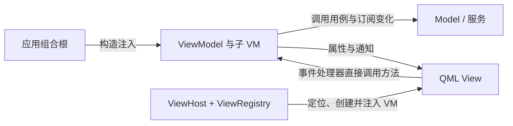

# Caliburn.Micro.Qt

受 **Caliburn.Micro** 启发，面向 **Qt Quick / QML 与 C++** 的 MVVM 支撑框架。

> 当前状态：前四批本机验收完成。框架提供属性通知、Screen 生命周期、视图注册与宿主、Bootstrapper、单项及集合型 Conductor。示例采用 Shell 根窗口、Home 计数与只读 Detail 导航，Home VM 常驻，View 每次新建；两页共享计数服务。独立构建、全部 CTest、qmllint、仅框架构建、Cocoa 与实际窗口结果见 [4C 验收记录](docs/4C验收记录.md)。Parent 与统一 Conductor 协议增量已实现并完成本机验收，见 [独立记录](docs/Parent体系验收记录.md)。受管页面 tryClose 与 Detail 内返回已实现并完成本机验收，见 [tryClose 记录](docs/tryClose验收记录.md)。第五、六批未实施，麒麟待验证。

这是一个独立项目。名称表达对 [Caliburn.Micro](https://caliburnmicro.com/) 的架构借鉴，不代表官方移植、官方关联或完整 API 对等，也不引入 .NET 版 CM 库。

## 为什么创建这个项目

WPF 与 Caliburn.Micro 提供了一组相互配合的概念：属性通知、Screen 生命周期、Conductor 组合、视图定位、操作与守卫，以及窗口管理。开发者可以围绕 ViewModel 组织界面，而不用在每个页面重复处理这些连接。

Qt 已有属性绑定、信号、元对象系统和动态加载等基础机制，第三方也有 [QtMvvm](https://github.com/Skycoder42/QtMvvm) 等 MVVM 项目。项目动机并不是“Qt 完全没有 MVVM 框架”，而是希望为 Qt Quick 建立一套以 CM 风格为核心、边界明确、可验证的组合约定。

我们希望减少这些重复工作：父 View 转发子组件的一组属性和信号，页面与业务对象的生命周期连接，页面切换混入业务状态判断，以及创建对象时底层依赖沿父子 VM 构造链传播。

这里的“严格遵循 MVVM”指本项目的设计约定。目前没有自动强制检查架构的能力；是否遵守这些边界，仍需要应用设计、代码评审和后续测试共同保证。

## 架构原则

- **View 绑定单个、明确类型的 VM**：业务 View 声明 `required property XxxViewModel viewModel`，通过属性读取、通知和操作表达交互。纯样式、按钮和 delegate 不必拥有独立业务 VM。
- **Model 与服务保存业务事实和规则**：VM 组织展示、操作意图及交互流程，页面激活状态不能代替业务会话状态。
- **VM 不持有控件**：VM 不保存 QML Item、按钮或窗口引用；焦点、键盘事件和布局留在 View 与通用视觉组件中。
- **父 VM 组合子 VM**：父对象接收所需子对象及自己直接使用的服务，不替子对象转交全部底层依赖。View 通过子 VM 属性嵌套装配。
- **组合根负责创建**：应用集中装配服务和 VM 树；需要按需创建时由应用提供类型化工厂，业务 VM 不访问容器或服务定位器。
- **所有权与生命周期分别明确**：C++ 持有 VM 树，QML 持有 View 树；View 先于其借用的 VM 销毁。装载或卸载 View 不隐式开始业务，也不隐式删除 VM。
- **操作显式绑定**：View 手写 enabled 与事件处理器，直接读取 VM 的可用状态并调用方法。VM 和业务用例各自检查职责内的前置条件，按钮禁用只是展示结果。

目标数据与操作路径：



## 与 Caliburn.Micro 的概念对应

这是职责上的借鉴，不能理解成接口一一移植。

| Caliburn.Micro 概念 | Qt 目标类型或方案 | 初始约定 |
| --- | --- | --- |
| PropertyChangedBase | ViewModelBase + QObject 属性系统 | 派生 VM 声明 Q_PROPERTY / NOTIFY，基类提供类型化 setAndNotify；不提供字符串通知入口。 |
| IChild / IParent / IConductor | 纯 C++ 协议与 ConductorBase | Screen 提供只读逻辑 Parent；统一子项快照和已接管对象的激活、停用接口。 |
| Screen | ScreenViewModel | 框架自动驱动，先提交状态再执行钩子；初始化一次，激活与普通停用幂等，已初始化对象每次关闭都执行钩子；异常不回滚已提交状态。 |
| Conductor<T> | Conductor<T> + ConductorViewModelBase | 已实现泛型单项导航；切换关闭旧项并延迟释放。4B 已接入 Shell，4C 已实现 Collection.OneActive，切换保留旧项。 |
| ViewLocator / ViewModelBinder | ViewRegistry、ViewHost | 按应用提供的 VM 类型映射定位 View，创建前注入 viewModel。 |
| ActionMessage / CanXxx | QML 原生属性绑定与事件处理器 | 1.0 不移植动作组件；显式绑定 enabled 并调用具体 VM，方法自身检查业务条件。 |
| IWindowManager / WindowManager 的模态职责 | IWindowManager、WindowManager、DialogHost | 5A 已实现接受自定义 VM 的通用模态弹窗，以 Home 重置确认为首个示例；普通窗口与 Popup 管理留待后续。 |
| IGuardClose / 关闭策略 | Conductor 关闭守卫与回调式请求协调 | 5B 规划 Detail 退出确认，覆盖成员关闭、单项替换及普通停用、父级关闭许可；保留同步生命周期。 |
| IoC / 构造注入 | 应用组合根 + Boost.Ext.DI v1.3.2 | 创建与长期持有分开，框架 VM 不依赖容器。 |
| Bootstrapper | BootstrapperBase + AppBootstrapper | Configure 配置映射和根工厂，OnStartup 显示根窗口，Run 统一生命周期与清理。 |

## 类型清单与实现状态

这是六批迭代的完整目标清单；“拥有”表示所有权契约。当前已实现 ViewModelBase、ScreenViewModel、ViewRegistry、ViewHost、BootstrapperBase、Parent 统一协议以及单项与集合型 Conductor。5A 弹窗与重置确认已实现并完成本机验收；5B 关闭守卫仍为规划中、未实施、未验证，详见 [第五批阶段划分](docs/迭代实现计划.md#第五批阶段划分)。

| 类型 | 形态 | 职责 |
| --- | --- | --- |
| ViewModelBase | C++ QObject 基类 | 提供共同类型及 protected setAndNotify，不新增业务属性、状态或信号；完整成员见专题。 |
| ScreenViewModel | C++ VM 基类、IChild | 同步生命周期及只读逻辑 parentViewModel。 |
| IChild / IParent / IConductor | 纯 C++ 接口 | 逻辑父级、借用子项快照与统一管理接口。 |
| ConductorBase | 抽象元对象基类 | 实现统一接口的元对象声明，提供 Parent 辅助逻辑和 activationProcessed 信号。 |
| ConductorViewModelBase / Conductor<T> | C++ Screen 子类与模板层 | 一个当前项；子项普通停用清空选择并留存 VM，切换关闭旧当前项。 |
| ConductorCollectionOneActiveViewModelBase / ConductorCollectionOneActive<T> | C++ Screen 子类与模板层 | 保留多个 VM，仅当前项激活；关闭当前项按前一项优先选择剩余成员。 |
| ViewRegistry | C++，向 QML 提供单例入口 | 按应用登记的 VM 类型查询 QML View 地址，不拥有 VM。 |
| ViewHost | QML 组件 | 使用 Loader 定位和加载 View，并注入唯一 viewModel 属性。 |
| ViewHostState | 公开、可创建的 QML 辅助类型 | 保护 VM 借用并验证 View 注入；页面装配优先使用 ViewHost，见 [公开接口](docs/ViewHost.md#4-借用与所有权)。 |
| BootstrapperBase | C++ 应用启动基类 | 编排配置、根对象创建、窗口加载、生命周期及退出清理，不依赖 DI 库。 |
| IWindowManager | 抽象 QObject 服务（5A 已实现） | 声明接受自定义 VM 的 showDialogAsync 通用模态弹窗入口，异步交付结果。 |
| WindowManager | C++ 服务（5A 已实现） | 协调临时弹窗 VM 的生命周期、一次结果和请求失效；所有权与完成顺序见窗口服务专题。 |
| DialogHost | QML 组件（5A 已实现） | 显示当前弹窗，处理模态隔离、关闭和焦点恢复。 |
| DialogHostState | 公开、可创建的 QML 辅助类型（5A 已实现） | 关联窗口服务并协调请求释放；标准展示优先使用 DialogHost，见 [公开接口](docs/WindowManager.md#dialoghoststate公开-qml-宿主协调接口)。 |
| ConfirmActionViewModel | C++ Screen 子类（5A 已实现） | 提供确认文案、accept / cancel 操作与一次完成结果。 |
| ConfirmActionView | QML View（5A 已实现） | 展示确认 VM，通过手写事件处理器调用接受或取消方法。 |
| IGuardClose / 关闭策略 | C++ 协议与协调机制（5B 规划中、未实施） | canClose(callback) 立即或延后交付许可；适用场景包括关闭及单项成员普通停用，拒绝时保留成员、选择和页面。 |

5A 配套值类型 **ConfirmationRequest**（已实现）保存 `title`、`message`、`confirmText`、`cancelText`，不保存业务操作枚举、控件或 VM 引用；它是确认 VM 的文案参数，不限制 IWindowManager 只能展示确认框。

ViewModelBase 的新增成员仅为构造函数、默认虚析构和 protected 模板辅助 `setAndNotify(field, value, &Owner::notifySignal)`。同值不通知，更新先赋值再同步通知；空信号或对象类型不兼容时诊断并拒绝修改。它没有 displayName、字符串通知入口或生命周期状态；QObject 的继承成员继续可用。完整接口、QML 注册与所有权约定见 [ViewModelBase](docs/ViewModelBase.md)。

已实现的 [Screen](docs/ScreenViewModel.md) 初始化一次、同步执行生命周期，提供只读逻辑 Parent。普通 ViewModelBase 默认不实现 IChild；自行声明该接口的 VM 也能接入。QObject 父树负责所有权，逻辑 Parent 由 Conductor 独立维护。

单项 `deactivateItem(item, false)` 清空选择并普通停用，保留 VM、Parent 和恢复资格；`activateItem(item)` 恢复原对象。切换新项关闭旧当前项，其他留存项不受影响；`closeItem` 可关闭当前或留存项。已初始化父关闭清理全部持有项，未初始化父关闭无操作；父普通停用仍保留选择。`getChildren()` 在单项只返回当前项，集合型返回全部成员，均为借用快照。详见 [Conductor](docs/Conductor.md) 和 [Parent 体系验收记录](docs/Parent体系验收记录.md)。

新项以类型化 unique_ptr 接管，校验 QObject 父对象、线程、自身或祖先、Screen 活动状态及逻辑 Parent。拒绝不移动调用方所有权；成功设置父对象与 CppOwnership。裸指针入口只操作内部记录中的尚未关闭对象，等待删除对象不能恢复。调用方保证主线程同步、转换不重入；受管 Screen 的 C++ tryClose 已通过逻辑 Parent 委托 IConductor 关闭。关闭守卫已纳入 5B 规划，尚未实施；根窗口请求、Action 和 View 缓存继续留待后续。

5A 已实现并完成本机验收，5B 仍为**规划中、未实施、未验证**。5A 的 showDialogAsync 接受自定义 VM，以 QFuture / QPromise 交付一次结果；只允许一个当前弹窗，忙时拒绝新请求，请求者失效后旧结果不能继续执行业务操作。结果为可空 bool，接受 true、明确取消 false、无决定关闭空值，忙和展示失败以异常交付，详见 [WindowManager](docs/WindowManager.md)。这是 Qt 适配差异：CM 3.2 WPF 使用同步 ShowDialog，本项目不为复刻阻塞返回引入嵌套事件循环。

5B 未来按 CM 3.2 将 activateItem、deactivateItem、closeItem、tryClose 迁移为普通命名的 void 请求入口，通过回调或完成通知表达结果；当前代码的同步 bool 接口保持现状。守卫立即同意时可在当前调用栈完成，延后回调时请求先返回，再继续同步生命周期，因此方法返回不保证页面已切换。单项替换和成员普通停用/关闭均检查守卫；集合型仅成员关闭检查，普通停用及内部切换不检查；父级普通停用不因此增加守卫。父级关闭许可覆盖全部持有成员，含单项留存项。完整签名、回调类型、所有权和关闭完成通知尚待设计，范围集中维护在 [迭代计划](docs/迭代实现计划.md#第五批阶段划分)。

## 模块与项目结构

当前已建立两个静态模块和独立启动程序，包含前四批及 Parent 协议增量需要的类型、服务与页面。下表同时说明后续扩展方向。

| 单元 | CMake 目标 | QML URI / 版本 | 内容及进度 |
| --- | --- | --- | --- |
| 通用框架模块 | `CaliburnMicroQt`，别名 `Caliburn::MicroQt` | `Caliburn.Micro.Qt 1.0` | 已实现基类、Screen 生命周期、注册表、ViewHost 和单项 Conductor；集合型 Conductor 和 5A 通用模态弹窗已实现。 |
| 示例用户代码模块 | `CaliburnExampleModule` | `CaliburnExample 1.0` | 已实现 Shell 根窗口和 Home 计数页、参数按钮、键盘输入及生命周期状态；共享计数服务及 Home 重建；Detail 只读详情导航已实现，确认交互待后续批次。 |
| 示例装配库 | `CaliburnExampleComposition` | 无独立 QML URI | Boost.Ext.DI 绑定共享服务及 Home/Detail 工厂，创建 Shell 并设置根 CppOwnership；子项由 Conductor 接管。 |
| 示例启动程序 | `CaliburnExampleApp` | 无独立 QML URI | AppBootstrapper 配置映射与根工厂，框架 Bootstrapper 统一启动、根生命周期、类型化注入及有序退出。 |

框架和用户模块均采用静态库，通过 `qt_add_qml_module` 组织各自的 C++ 与 QML；应用的两个插件由 Qt 导入扫描链接，QML 测试仅显式补充动态 URL 加载所需的示例插件，并保留 Q_IMPORT_QML_PLUGIN 导入。静态类型注册及内嵌资源加载已验证，重复库警告的清理与检查见 [链接依赖清理验收记录](docs/链接依赖清理验收记录.md)。示例装配库采用 Boost.Ext.DI，Shell 通过构造注入工厂，由 Conductor 接管 Home；两个 QML 模块和 VM 头文件不包含 DI。

```text
caliburn-micro-qt/
├── docs/                          # 设计文档与各批验收记录
├── modules/Caliburn/Micro/Qt/      # 框架、两种 Conductor 与 Parent 协议
├── examples/minimal/              # 已实现 Shell 根窗口与 Home 计数页面
│   ├── app/                      # 示例启动与组合根
│   └── CaliburnExample/           # 用户代码模块
├── third_party/boost-di/          # 固定 v1.3.2 单头文件与许可证
├── tests/                         # 已有核心、装配与 QML 集成测试
├── CMakeLists.txt                 # 已有模块及构建选项
└── CMakePresets.json              # 已有可移植 debug 预设
```

依赖方向为“启动程序 → 应用装配库 → 用户代码模块 → 框架模块 → Qt”；装配库私有依赖 Boost.Ext.DI。第一、二批直接加载 `qrc:/qt/qml/CaliburnExample/views/ShellView.qml`，根窗口声明 `required property ShellViewModel viewModel`。第三批已加入框架通用视图注册机制，应用在加载前登记 Shell 根窗口和 Home 子页面映射，5A 已加入框架确认映射。框架不引用用户类型或业务模块。

Shell 是本项目的应用入口命名约定，与 qt-snake-lab 的入口命名保持一致。ShellViewModel 第一批继承 ViewModelBase，第三批已演进为 ScreenViewModel，第四批 4B 采用单项 Conductor，4C 已采用集合型 Conductor 保留 Home VM；ShellView.qml 始终是根窗口。第一、二批计数由 Shell 保存，第三批已整体移入 Home 子页面，第四批 4B 已将计数事实迁入共享业务服务，Home VM 常驻与 Detail 导航在 4C 已实现，View 每次新建。

完整目录、类型归属、模块接入及 qt-snake-lab 调整概要见 [模块与项目结构](docs/模块与项目结构.md)。该概要只规划游戏仓库的后续接入，尚未修改其结构设计。

## 技术起点与边界

| 项目 | 设计基线 |
| --- | --- |
| Qt | 6.8.3，Qt Quick / QML；已验证 macOS arm64，麒麟待验证。 |
| C++ | C++17，QObject 属性、信号与元对象系统。 |
| 构建 | CMake 3.21 及以上、Ninja、qt_add_qml_module；框架/示例用户模块为静态库。 |
| 应用装配 | 已采用 Boost.Ext.DI v1.3.2，固定源码及许可证随仓库提供，配置时校验头文件 SHA-256，构建不下载依赖。 |
| 操作与输入 | QML 显式读取可用状态并直接调用方法；第一批演示无参数，第二批演示 int 参数和原生键盘事件。框架不规定方法名、返回值或自动守卫契约。 |
| 视图映射 | 应用配置的类型到 View 映射，初始化阶段确定，不硬编码某个示例的页面数量。 |

Home 和 Detail 显式接收非空 shared_ptr<CounterService>，唯一计数由服务保存。Shell 继承 Conductor<ScreenViewModel>::Collection::OneActive，注入两个页面工厂与 IWindowManager；Home.reset 通过确认后才重置，停用时取消待处理请求。进入 Detail 保留并停用 Home VM；Detail 内的返回按钮调用 goBack → tryClose，通过 Parent 委托 Shell 关闭自己，自动选回 Home。home/detail 从集合查找，ViewHost 绑定 activeItem。Home View 离开即卸载、返回重新创建，计数和 VM 保留，文本及焦点按新页面初始化。Shell 关闭清空全部成员，再激活新建 Home 并保留服务。DI 仅在装配层，每个 buildShell 的服务独立。详见 [应用装配](docs/IoC与应用装配.md)、[4C 历史记录](docs/4C验收记录.md) 与 [tryClose 验收记录](docs/tryClose验收记录.md)。

## 阅读文档

- [模块与项目结构：框架、用户代码与贪吃蛇接入概要](docs/模块与项目结构.md)
- [迭代实现计划：框架与 example 同步交付](docs/迭代实现计划.md)
- [第一批验收记录：环境、测试与真实界面操作](docs/第一批验收记录.md)
- [第二批验收记录：参数、键盘与焦点](docs/第二批验收记录.md)
- [第三批验收记录：生命周期与视图装配](docs/第三批验收记录.md)
- [IoC 与应用装配：构造注入、父所有权与根生命周期](docs/IoC与应用装配.md)
- [IoC 装配验收记录](docs/IoC装配验收记录.md)
- [Bootstrapper：配置、根窗口启动与退出清理](docs/Bootstrapper.md)
- [Conductor：单项与 Collection.OneActive](docs/Conductor.md)
- [4B 验收记录](docs/4B验收记录.md)
- [4C 验收记录](docs/4C验收记录.md)
- [Parent 体系验收记录](docs/Parent体系验收记录.md)
- [tryClose 验收记录](docs/tryClose验收记录.md)
- [后续版本 ToDoList：View 保留、Action 与根窗口衔接](docs/后续版本ToDoList.md)
- [Conductor 核心验收记录](docs/Conductor核心验收记录.md)
- [WindowManager：通用模态弹窗与重置确认](docs/WindowManager.md)
- [5A 验收记录](docs/5A验收记录.md)
- [ScreenViewModel：同步生命周期](docs/ScreenViewModel.md)
- [ViewModelBase：类型基础、完整成员与通知辅助](docs/ViewModelBase.md)
- [ViewHost：视图定位、动态加载与所有权](docs/ViewHost.md)
- [操作与输入绑定：显式条件、方法调用与键盘事件](docs/操作与输入绑定.md)

设计起点来自 [qt-snake-lab](https://github.com/soapgu/qt-snake-lab) 中的 [Qt 实现方案](https://github.com/soapgu/qt-snake-lab/blob/main/docs/贪吃蛇Qt实现方案.md) 与 [源码结构设计](https://github.com/soapgu/qt-snake-lab/blob/main/docs/贪吃蛇Qt源码结构设计.md)。贪吃蛇用于解释页面、子 VM 与动态释放，是框架的使用场景，不是框架的业务边界。

## 构建、运行与测试

需要 Qt 6.8.3 及以上（框架需要 Core/Qml/Quick/QuickControls2，测试另需 Test）、CMake 3.21 及以上、Ninja 和支持 C++17 的编译器。将 QT_ROOT 设置为本机 Qt kit 的根目录；公共预设不包含个人路径。

```sh
export QT_ROOT="你的 Qt kit 根目录"
cmake --preset debug
cmake --build --preset debug
ctest --preset debug
cmake --build --preset debug --target all_qmllint
```

macOS 启动 `build/debug/bin/CaliburnExampleApp.app`，也可执行：

```sh
./build/debug/bin/CaliburnExampleApp.app/Contents/MacOS/CaliburnExampleApp
```

Linux 的预期入口为 `build/debug/bin/CaliburnExampleApp`，尚未在麒麟验证。CTest 的 QML 测试默认使用 offscreen/software；macOS 可额外运行 `QT_QPA_PLATFORM=cocoa ./build/debug/tests/CaliburnQmlTests`。真实窗口操作记录与离屏测试分别记录。

当前示例还支持“加 2”按钮与无修饰数字键 `2`，计数超过 3 时禁用。文本框中的数字键用于输入文字，点击空白处恢复页面焦点；长按重复事件不会增加计数。

普通按钮直接绑定 VM 的可用状态与方法，objectName 仅用于对象标识与测试：

```qml
Item {
    id: root
    required property HomeViewModel viewModel

    Button {
        objectName: "increment"
        text: root.viewModel ? root.viewModel.incrementText : "增加"
        enabled: root.viewModel !== null && root.viewModel.canIncrement
        onClicked: { if (root.viewModel) root.viewModel.increment() }
    }
    Button {
        objectName: "reset"
        text: "重置"
        enabled: root.viewModel !== null && root.viewModel.canReset
        onClicked: { if (root.viewModel) root.viewModel.reset() }
    }
}
```

片段省略 QtQuick、QtQuick.Controls 与用户模块导入。特殊目标在表达式中直接引用具体 VM；可空目标显式处理空值。属性的 NOTIFY 驱动 enabled 刷新，VM 方法自身检查条件。框架不扫描按钮、不管理 enabled、不按名称寻找方法；完整用法见 [操作与输入绑定](docs/操作与输入绑定.md)。

仅构建框架时关闭示例和测试：

```sh
cmake -S . -B build/framework-only -G Ninja -DCMAKE_PREFIX_PATH="$QT_ROOT" \
    -DCALIBURN_BUILD_EXAMPLE=OFF -DCALIBURN_BUILD_TESTS=OFF
cmake --build build/framework-only
```

当前提供源码模块接入，尚未实现安装导出包；外部消费工程和平台验证在第六批完善。静态 QML 模块的插件要求见 [Qt 官方说明](https://doc.qt.io/qt-6.8/qt-add-qml-module.html)。

## 持续集成

[GitHub Actions CI](https://github.com/soapgu/caliburn-micro-qt/actions/workflows/ci.yml) 在推送 main、向 main 提交 PR 或手动触发时运行。工作流固定 Qt 6.8.3，分别使用 Ubuntu 24.04 x64 与 macOS 15 arm64，覆盖框架和示例构建、全部 CTest、all_qmllint，以及关闭示例和测试后的仅框架构建与 QML 检查。

QML 测试使用 offscreen/software；CI 不替代 Cocoa 人工窗口操作或麒麟验收。Qt 安装缓存用于减少重复下载，测试报告及配置日志保存 7 天，可在每次运行的附件中下载。工作流文件位于 [.github/workflows/ci.yml](.github/workflows/ci.yml)。

## 当前状态与后续方向

第一批已交付框架基础和 Shell 示例，第二批增加 add(int)、canAddTwo、“加 2”按钮和数字键 2 操作。文本框优先消费输入，页面过滤自动重复；Tab / Shift+Tab 显式切换焦点并跳过禁用按钮。第二批独立目录配置与构建、CTest、qmllint、Cocoa 测试和真实示例操作均通过。详情见 [第一批验收记录](docs/第一批验收记录.md) 与 [第二批验收记录](docs/第二批验收记录.md)。第三批已实现 ScreenViewModel、ViewRegistry 与 ViewHost，计数整体迁入 Home；自动检查及实际窗口验收通过，见 [第三批验收记录](docs/第三批验收记录.md)。第四批 4A 已实现泛型单项 Conductor 核心与测试；4B 已改造 Shell 与共享计数服务，关闭后重建 Home 保留计数，见 [4B 验收记录](docs/4B验收记录.md)；4C 已完成 Collection.OneActive 和 Detail 导航，见 [4C 验收记录](docs/4C验收记录.md)；5A 通用模态弹窗与重置确认已通过本机验收，下一步 5B 退出确认与关闭守卫；麒麟与外部消费工程待验证。

后续每批同时交付框架功能、example、必要测试和验收记录，验收通过后进入下一批：

| 批次 | 框架与 example 同步目标 | 当前状态 |
| --- | --- | --- |
| 1．单页面绑定 | 基类与类型化通知辅助；Shell 单页面计数文字及按钮 enabled/onClicked 显式绑定。 | 已完成，macOS arm64 验收通过 |
| 2．参数与键盘 | Shell 同页演示 int 参数按钮与原生键盘事件，直接调用 VM，不增加框架输入组件。 | 已完成，macOS arm64 验收通过 |
| 3．生命周期与视图装配 | Screen、注册表与 ViewHost；Shell 根入口、Home 计数页面及 VM 替换。 | 已完成，macOS arm64 验收通过 |
| 4．页面组合与导航 | 4A 单项核心、4B 共享服务、4C 集合型与 Detail 均已完成。 | 第四批本机验收完成；麒麟待验证 |
| 5A．重置确认 | IWindowManager / WindowManager 通用模态弹窗、确认 VM/View 与 DialogHost；Home 重置确认、请求失效及焦点。 | 已实现，macOS arm64 验收通过；麒麟待验证 |
| 5B．Detail 退出确认与关闭守卫 | Detail 返回通过回调式守卫确认；覆盖成员关闭、单项替换及普通停用、父级关闭许可；未来迁移 void 请求入口。 | 规划中、未实施；未验证 |
| 6．下游接入与平台验证 | 独立消费工程、静态模块接入及 macOS/麒麟验证。 | 未实施、未验证 |

第四批阶段与历史验收分别记录：

| 阶段 | 交付 | 当前状态 |
| --- | --- | --- |
| 4A | 泛型单项 Conductor 核心。 | 已完成 |
| 4B | 单项 Shell 接入、共享计数服务及关闭后重建。 | 已完成，见 [记录](docs/4B验收记录.md) |
| 4C | Collection.OneActive、Home VM 常驻、只读 Detail 导航及返回后释放。 | 已完成，见 [记录](docs/4C验收记录.md) |

第四批本机验收完成，麒麟待验证。当前采用集合型，普通单项的切换关闭契约保持不变。View 每次新建，集合导航视图保留机制仅列入 [后续版本 ToDoList](docs/后续版本ToDoList.md)。接口与阶段安排见 [Conductor](docs/Conductor.md) 和 [迭代实现计划](docs/迭代实现计划.md#第四批阶段划分)。

第一版只要求 ShellView 一个页面：初始文字为“已点击 0 次”，增加按钮的文字绑定 ShellViewModel 属性，按钮的 onClicked 直接调用 C++ VM；点击到 5 时禁用增加，重置后归零。第一批不引入生命周期、导航、快捷键、业务服务或弹窗。接口与验收细节见 [迭代实现计划](docs/迭代实现计划.md)。

## 参考与许可

- [Caliburn.Micro：组合与生命周期](https://caliburnmicro.com/documentation/composition)
- [Caliburn.Micro：操作与守卫](https://caliburnmicro.com/documentation/actions)
- [Caliburn.Micro：命名约定](https://caliburnmicro.com/documentation/conventions)
- [Qt：向 QML 暴露 C++ 属性与方法](https://doc.qt.io/qt-6.8/qtqml-cppintegration-exposecppattributes.html)
- [Boost.Ext.DI 文档](https://boost-ext.github.io/di/user_guide.html)与 [v1.3.2](https://github.com/boost-ext/di/releases/tag/v1.3.2)

本仓库采用 [MIT 许可](LICENSE)，版权标识为 2026 soapgu。Qt、Caliburn.Micro 与其他外部项目分别适用其自身许可。
