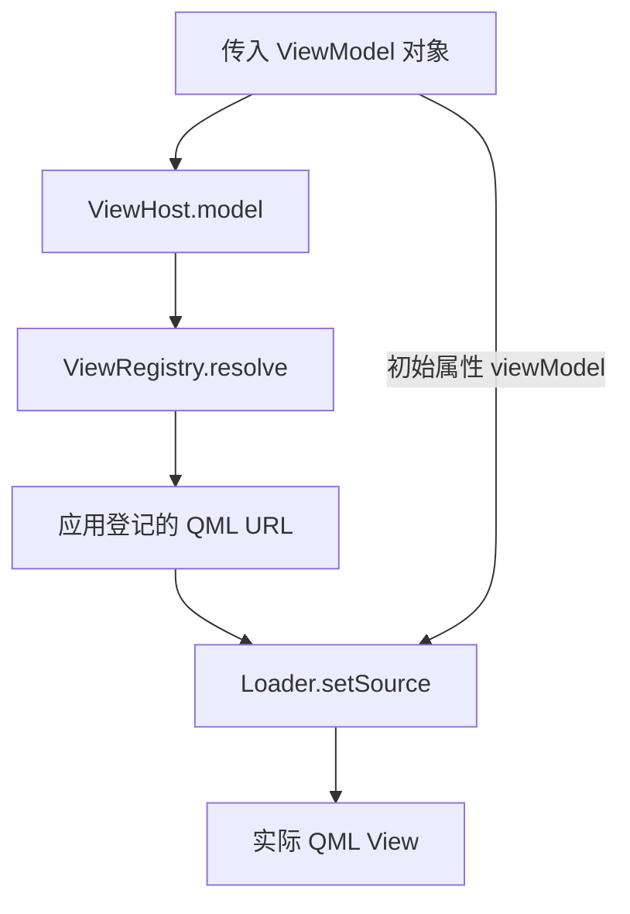

# ViewHost：视图定位、动态加载与所有权

> 状态：设计说明，尚未实现。本文所有代码均为设计示例，省略框架和应用模块导入、完整类型注册及工程配置，不能直接作为可运行工程。

ViewHost 回答的问题是：**给定一个 ViewModel，现在应该在这个位置显示哪个 View？**

它可以服务于根活动页面，也可以服务于页面内部的子 VM。与它配合的 [ActionBinding](ActionBinding.md) 负责从用户操作调用 VM；整体原则见 [README](../README.md)。

## 1. 与 WPF ContentControl、Caliburn.Micro 的对应关系

WPF 的 ContentControl 可以承载动态内容，并借助 DataTemplate 选择展示方式；Caliburn.Micro 则提供根据 ViewModel 定位、绑定 View 的能力。

Qt Quick 提供动态创建 QML 对象的基础组件 Loader。本项目在它之上增加 ViewRegistry 与 ViewHost，形成面向 VM 的装配入口。

| 需求 | WPF / CM 中的相关概念 | Qt 设计 |
| --- | --- | --- |
| 容纳当前内容 | ContentControl | ViewHost 的视觉位置与布局。 |
| 选择展示方式 | DataTemplate / CM ViewLocator | ViewRegistry 查询应用提供的类型映射。 |
| 创建界面 | 模板实例化或视图创建 | Loader 创建目标 QML View。 |
| 连接 View 与 VM | DataContext / CM ViewModelBinder | 创建前设置 View 的 required viewModel 属性。 |

这是职责对照。ViewHost 不实现 WPF 的模板系统，也不提供 DataContext 的隐式继承。每个业务 View 明确接收自己的 VM。

## 2. 三个组件各自做什么

**Loader** 是 Qt 原生的对象加载器。**ViewRegistry** 是计划中的 C++ 类型映射入口。**ViewHost** 是计划中的 QML 视觉宿主，串联查询、加载和注入。



目标接口：

| 成员 | 含义 |
| --- | --- |
| ViewHost.model：ViewModelBase | 借用要展示的 VM；null 表示无内容。 |
| ViewHost.item：只读 Item | 当前加载完成的视觉对象；未加载或失败时为空。 |
| ViewRegistry.resolve(ViewModelBase*)：QUrl | 向 QML 提供类型映射查询，不创建 VM。 |
| ViewRegistry.viewUrl(const ViewModelBase*)：静态 QUrl | 供 C++ 根装配入口使用同一映射表。 |

首版业务 View 的根对象要求为 Item 或其子类。Loader 自身还能加载非视觉 QObject，但不属于这里的视觉宿主契约。

ViewRegistry 的映射由使用应用在装配阶段提供，运行展示阶段查询稳定的映射。本文不规定尚未实现的注册函数签名。贪吃蛇示例有九对类型；框架不限定九对，也不内置这些业务类型。

映射的概念示例：

| 应用 VM 类型 | 应用 View 资源 |
| --- | --- |
| HomeViewModel | views/HomeView.qml |
| GameViewModel | views/GameView.qml |
| DifficultyViewModel | views/DifficultyView.qml |

VM 不保存这些资源地址；路径与映射属于应用的视图装配配置。

## 3. View 如何接收 VM

以 HomeView 为例，根对象声明明确类型的属性：

```qml
// 设计示例：HomeView.qml，省略应用模块导入。
import QtQuick

Item {
    required property HomeViewModel viewModel

    Text {
        text: viewModel.title
    }
}
```

`required` 表达创建契约：构造这个 View 时就需要提供 viewModel。不能把“加载完成后再赋值”作为正常装配流程。

因此，宿主在创建前传入初始属性：

```qml
// 设计示例：loader、url、model 均已由宿主提供。
loader.setSource(url, { viewModel: model })
```

应用入口创建根 View 时，同样先设置初始属性，再加载注册表返回的 URL；根与子页面使用同一套类型映射，避免维护两份定位规则。

## 4. ViewHost 的最小用法

假设 ShellViewModel 是 Conductor，公开 activeItem：

```qml
// 设计示例：ShellView 的内容区域。
ViewHost {
    anchors.fill: parent
    model: viewModel.activeItem
}
```

应用把 activeItem 设为 HomeViewModel，宿主显示 HomeView；设为 GameViewModel，宿主显示 GameView；设为 null，宿主清空。

QML 不需要根据业务枚举判断“现在加载哪个页面”，也不在加载时自行创建业务 VM。选择活动对象属于 VM/Conductor 的职责，页面资源查找属于 ViewRegistry。

一个用于讲解加载顺序的宿主草图如下。它并非完整实现，省略了目标销毁保护、焦点恢复和详细错误报告：

```qml
// 设计示例：ViewHost 的加载核心，省略框架模块导入。
import QtQuick

Item {
    id: root

    property ViewModelBase model: null
    readonly property Item item: loader.item
    property bool readyToLoad: false

    function reloadView() {
        // 即使新旧 VM 映射到同一 URL，也先卸载旧实例。
        loader.source = ""

        if (!root.model)
            return

        const url = ViewRegistry.resolve(root.model)
        if (!url || url.toString().length === 0) {
            console.warn("ViewHost：VM 缺少有效 View 映射")
            return
        }

        loader.setSource(url, { viewModel: root.model })
    }

    onModelChanged: {
        if (readyToLoad)
            reloadView()
    }

    Component.onCompleted: {
        readyToLoad = true
        reloadView()
    }

    Loader {
        id: loader
        anchors.fill: parent
        focus: true

        onStatusChanged: {
            if (status === Loader.Error)
                console.warn("ViewHost：QML View 加载失败", source)
        }
    }
}
```

正式实现应将可见 item 保持为空直到成功装配；无映射、无效资源、required 属性不满足或类型不符时给出明确诊断，不静默显示旧页面或替代页面。

## 5. 什么变化会重建 View

| 变化 | 宿主行为 |
| --- | --- |
| model 从 Home 对象换成 Game 对象 | 卸载旧 View，定位并创建新 View。 |
| model 换成另一个同类型的 VM | 即使 URL 相同，也重新装配，不能继续引用旧 VM。 |
| 同一个 VM 的 title、score 等属性变化 | 属性通知刷新对应绑定，不重建 View。 |
| model 变为 null | 卸载 View，item 为空。 |
| 目标 VM 被销毁 | 解除借用，清空展示，不保留失效引用。 |

不能只监听 URL 变化，因为两个不同的 VM 实例可能对应同一份 QML 文件。重装配的依据是对象替换。

## 6. 页面内部也可以使用 ViewHost

在贪吃蛇使用场景中，Home 组合 Difficulty，Game 组合 Board、Status 和覆盖层：

```qml
// 设计示例：HomeView 的一个子区域。
ViewHost {
    model: viewModel.difficulty
}
```

```qml
// 设计示例：GameView 的三个子区域，布局省略。
ViewHost { model: viewModel.board }
ViewHost { model: viewModel.status }
ViewHost { model: viewModel.overlay.activeItem }
```

这里的 difficulty、board、status 是父 VM 的属性，指向不同子对象，不是不同种类的 ViewHost。每个子 View 接收自己的单个 VM；父 View 不逐项转发分数、按钮条件或业务信号。

覆盖层 activeItem 可以指向 Pause、Result，也可以为空。选择由 Conductor 完成，宿主只负责展示。

## 7. View 树与 VM 树分别由谁管理

| 对象 | 创建与所有权 |
| --- | --- |
| 根 VM | 应用组合根创建，由根 unique_ptr 等明确的 C++ 所有者持有。 |
| 子 VM | 经构造注入或应用工厂创建，验证后交给 QObject 父树管理。 |
| QML View | Loader/QML 创建与释放，只借用 VM。 |
| 服务 | 应用长期持有，VM 借用；寿命长于使用者。 |
| ViewRegistry | 目标为 QML 引擎管理的查询单例，不拥有 VM。 |

VM 接管子对象时，临时 unique_ptr 在设置 QObject 父对象成功后 release，成员指针只用于访问。不能让 unique_ptr 与 QObject 父树同时负责同一个子对象的删除。暴露给 QML 的应用 VM 使用 CppOwnership，QML 的属性引用不转移其所有权。

Loader 卸载 View 不等于销毁 VM。Conductor 单纯切换活动项也不自动删除旧 VM；是否常驻、按需创建或返回后释放，由应用生命周期策略决定。

动态页面的顺序示例：

```text
应用工厂创建候选页面 VM 子树
    → 初始化并执行开始用例
    → 成功后登记、接管并激活
    → activeItem 变化，ViewHost 装配对应 View

返回用例成功
    → 停用旧 VM、禁用交互并取消所属弹窗请求
    → 切换 activeItem，宿主替换 View 与动作目标
    → 清空应用持有的旧访问指针
    → removeItem 取消登记并安排 deleteLater
```

开始失败时由应用释放候选对象，保留原页面。不能在旧 VM 自身信号或确认回调栈中同步删除它。停用、析构、加载和卸载都不能代替开始、返回或结算用例。

退出时先销毁 QML 引擎与 View，再销毁根 VM 树，最后释放借用服务。尚未执行的 deleteLater 对象仍保留 QObject 父关系，可由父树回收。

## 8. 焦点与生命周期边界

View 可以公开视觉属性 `readonly property Item defaultFocusItem`，供宿主在活动页面创建完成、窗口活动且没有上层模态交互时恢复默认焦点。它只存在于 View 一侧，不放进 VM。

Loader 本身是焦点作用域，嵌套页面需要相应的 focus 配置。覆盖层关闭、可交互子区域重新可用时，也可能需要视觉层恢复焦点；仅监听一次加载完成并不覆盖所有情况。

窗口失焦时不抢焦点，恢复焦点不自动继续业务。嵌套展示组件也不能各自在加载时争抢焦点。ViewHost 不调用 VM 的 initialize/activate/deactivate，生命周期由应用或 Conductor 管理。

## 9. 待实现验收场景

- 应用登记映射，根与子页面使用同一查询入口；未知类型明确诊断。
- required viewModel 在创建前满足，实际收到的 VM 身份与传入对象一致。
- 同类型不同 VM 也重装配；同一 VM 的属性变化不重建。
- null、目标销毁和加载错误清空展示，旧 View/动作绑定不保存旧目标。
- 动态页面先卸载视觉引用再延迟释放 VM，退出时没有悬挂借用。
- 模态关闭后焦点恢复，窗口失焦和业务停用期间不抢焦点。

这些是未来验收设计，不是已有通过结果。

## 参考资料

- [Qt Loader：动态加载与 setSource 初始属性](https://doc.qt.io/qt-6.8/qml-qtquick-loader.html)
- [Qt required 属性](https://doc.qt.io/qt-6.8/qtqml-syntax-objectattributes.html#required-properties)
- [Qt C++ 与 QML 数据所有权](https://doc.qt.io/qt-6.8/qtqml-cppintegration-data.html#data-ownership)
- [Caliburn.Micro：命名约定与 View 定位](https://caliburnmicro.com/documentation/conventions)
- [Caliburn.Micro：组合与生命周期](https://caliburnmicro.com/documentation/composition)
