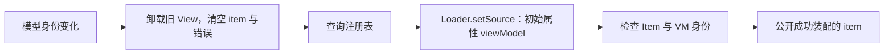

# ViewHost：视图定位、动态加载与所有权

第三批已实现 ViewRegistry 与 ViewHost，属于静态框架模块 `Caliburn.Micro.Qt 1.0`。本机验收状态见 [第三批验收记录](第三批验收记录.md)。生命周期由 [ScreenViewModel](ScreenViewModel.md) 提供，宿主负责 View 装配。

## 1. 登记与查询

应用在配置阶段登记业务映射，完成后显式冻结。使用 BootstrapperBase 时，它在 Configure 成功后自动调用 freeze()；独立使用注册表与宿主时，由应用在创建界面前调用：

```cpp
const bool registered = ViewRegistry::registerView<HomeViewModel>(
    QUrl(QStringLiteral("qrc:/qt/qml/CaliburnExample/views/HomeView.qml")));
const bool frozen = ViewRegistry::freeze();
const QUrl url = ViewRegistry::viewUrl(home);
```

`registerView<T>(const QUrl&) -> bool` 编译期要求 T 继承 ViewModelBase。登记使用 T::staticMetaObject，查询使用运行时 QMetaObject；具体类型需要自己的 Q_OBJECT 才有独立映射身份。注册表不按名称猜路径，不沿基类回退。

| 输入或时机 | 结果 |
| --- | --- |
| 有效、非空、绝对 URL | 登记成功；不提前检查资源存在性。 |
| 相同类型与 URL 再次登记 | 冻结前返回 true。 |
| 已显式登记的相同类型、不同 URL | 返回 false 并诊断，保留原映射。 |
| 空、非法、相对 URL | 返回 false 并诊断，不修改表。 |
| freeze() | 在应用主线程返回 true 并冻结；重复调用返回 true，随后任何登记均拒绝。非法线程调用返回 false，不改变配置。 |
| 空对象查询 | 返回空 URL，不改变冻结状态。 |
| 非空对象查询 | 冻结前后均可查询，不改变冻结状态；配置阶段查询后仍可继续登记。 |
| 无应用映射但有框架默认映射 | 返回默认 URL，目前包含 ConfirmActionViewModel。 |
| 无应用或默认映射的实际类型 | 诊断并返回空 URL，不使用基类映射。 |

C++ 静态 `viewUrl(const ViewModelBase*)` 与 QML 单例 `resolve(ViewModelBase*)` 共用进程级表。freeze() 是 C++ 配置入口，不向 QML 暴露。每个引擎拥有自己的查询单例，销毁或重建引擎不丢失映射或冻结状态。表只保存元对象和 URL，不保存 VM。登记、冻结和查询均限定在应用主线程，非法线程调用诊断并拒绝；展示 VM 的生命周期由调用方保证在应用主线程执行。未知类型及非法查询也不冻结注册表；运行期不提供解冻或清空接口。

框架默认映射与应用映射分开保存，优先查询应用映射。ConfirmActionViewModel 无须由应用登记，独立使用 ViewRegistry 时也能取得默认确认视图。冻结前可用普通 registerView 显式覆盖默认映射，不算冲突；查询不会冻结配置。覆盖指向无效资源时正常报告加载失败，不退回默认视图。

## 2. 宿主接口与用法

| 属性 | 契约 |
| --- | --- |
| model: ViewModelBase | 可读写，借用目标；默认 null。 |
| 只读 item: Item | 成功装配的 View；未完成、清空或失败时 null。 |
| 只读 errorString: string | 最近一次装配错误；新装配开始或空模型时清空。 |

Shell 是 ApplicationWindow，由引擎直接创建，不能放入 ViewHost。HomeView 的根 FocusScope 是 Item 子类，声明 required property HomeViewModel viewModel。Shell 内容区域使用以下片段，省略导入与根窗口：

```qml
ViewHost {
    model: root.viewModel ? root.viewModel.activeItem : null
    focus: true
    Layout.fillWidth: true
    Layout.fillHeight: true
}
```

完整代码见 [ShellView.qml](../examples/minimal/CaliburnExample/qml/views/ShellView.qml)。Loader 将页面尺寸设为宿主的可用区域，内部布局由页面决定。

## 3. 创建与失败处理



组件完成创建后才加载；身份变化先卸载旧实例，再调用 `Loader.setSource(url, { viewModel: model })`，使 required 属性在创建阶段得到值，不在 onLoaded 后补注入。[Qt Loader 初始属性机制](https://doc.qt.io/qt-6.8/qml-qtquick-loader.html#setSource-method)

本批使用本地内嵌资源与同步 Loader。无映射、资源不存在、语法错误、required 属性缺失、类型不兼容、缺少 viewModel、创建过程中改写了 VM 身份以及非 Item 根对象都会留下空内容与错误文字，并输出诊断。失败不保留旧页面，不自动重试；换成有效模型可重新装配。Loader 错误文字保留请求 URL，详细 QML 原因由引擎诊断提供。

| 变化 | 结果 |
| --- | --- |
| 换成另一类型 VM | 卸载旧 View，查询并创建新 View。 |
| 换成同类型另一对象 | URL 相同也重建 View。 |
| 同一对象属性通知 | 只刷新绑定，View 身份不变。 |
| 同一对象重复赋给 model | 不重建。 |
| null 或目标销毁 | 清空展示及错误文字。 |
| 旧对象在替换后销毁 | 不影响新对象与页面。 |

替换后不要保留旧控件裸指针。QML 绑定更新可能在后续事件处理发生，测试先等待当前 item 的 viewModel 身份匹配，再获取新控件。

## 4. 借用与所有权

ViewHostState 是 `Caliburn.Micro.Qt 1.0` 模块公开、可创建的 QML 辅助类型。应用导入模块后可以直接使用 `ViewHostState {}`，ViewHost 自身也通过这种方式创建它。其头文件位于 src，不作为公开 C++ 头文件提供；这不限制它的公开 QML 接口。一般页面装配优先使用 ViewHost 的三个属性。

本模块的 [DialogHostState](WindowManager.md#dialoghoststate公开-qml-宿主协调接口) 同样是公开、可创建的 QML 辅助类型，负责弹窗服务关联与请求释放；ViewHostState 负责 VM 借用与注入验证。两者职责分开，DialogHost 通过 ViewHost 复用页面装配。

| ViewHostState 的 QML 接口 | 契约 |
| --- | --- |
| model: ViewModelBase | 可读写，默认 null；借用 VM，不接管所有权。赋值必须在辅助对象所属线程执行，非空 VM 必须属于同一线程；非法赋值输出诊断并保留旧模型。 |
| modelChanged() | 模型身份变化或当前模型销毁时通知；重复赋入同一对象不通知，VM 自身属性变化不触发此信号。 |
| matchesView(view: QObject) -> bool | 当前模型和 view 均非空，且 view 的 viewModel 属性可转换为 QObject 指针并与当前模型指针相同时返回 true；否则返回 false。 |

ViewHostState 用 QPointer 保存模型，替换时断开旧 destroyed 连接。销毁通知到达时指针可能已清空，因此回调无条件发送 modelChanged，触发 ViewHost 卸载。QML 可创建性由契约测试覆盖。

C++ 拥有 VM，暴露前设 CppOwnership。Loader 拥有 View，卸载不删除 VM，也不调用生命周期。Shell 通过集合型 Conductor 接管页面，建立父关系并设置 CppOwnership；home/detail 从集合查找，通过 itemsChanged 通知，实际宿主仍绑定 activeItem。计数服务由两个工厂及 Home/Detail 的 shared_ptr 管理，无 QObject 父对象。关闭清空当前项时，宿主先卸载 View，Conductor 再关闭并延迟回收 VM；根引擎与 View 在根 VM 之前销毁。详见 [IoC 与应用装配](IoC与应用装配.md)。

## 5. 焦点与后续边界

ViewHost 使用 FocusScope，内部 Loader 设置 focus。Shell 给宿主设置 focus，Home 根 FocusScope 和内部输入 Item 也设置 focus，形成窗口至页面的焦点链。按键处理位于输入 Item；空白点击对该 Item 调用 forceActiveFocus，避免作用域保留文本框焦点。[Qt 焦点作用域](https://doc.qt.io/qt-6.8/qtquick-input-focus.html)

窗口失焦不自动停用 VM。泛型单项 Conductor 核心已实现，并通过 activeItem 绑定宿主的集成验证，见 [Conductor](Conductor.md)。集合型 Conductor 和详情导航在 4C 已实现，仍沿用当前 ViewHost。通用页面默认焦点恢复、View 缓存、异步加载和自动重试未实现。5A 已由 DialogHost 复用本宿主展示 WindowManager 的模态弹窗并处理弹窗焦点恢复，见 [WindowManager](WindowManager.md)；5B 已在关闭守卫等待或拒绝期间保留相关页面，见 [5B 验收记录](5B验收记录.md) 和 [阶段划分](迭代实现计划.md#第五批阶段划分)。页面内部可使用同一宿主装配子 VM，无须复制加载规则。

验收覆盖跨模块 typed 注入、创建完成时机、同类型替换、属性变化保持身份、清空与销毁、旧连接解绑及各类失败；证据与平台限制见 [第三批验收记录](第三批验收记录.md)。

## 6. 4C 导航：VM 保留，View 每次新建

ShellView 的 model 继续绑定 activeItem，HomeView/DetailView 分别声明 required typed viewModel。集合保存 Home VM，但 ViewHost 在切换时卸载原 View；返回同一 Home VM 也创建新的 View，因此文本框恢复空值、焦点按新页面初始化，计数从共享服务读取。

返回时 Shell 关闭 Detail，集合先公布 Home 为当前项；宿主卸载 Detail View、创建 Home View，Detail VM 随后延迟删除。Shell 关闭时清空集合与选择，宿主清空。意外销毁当前项同样清空界面，不自动导航。

本轮没有修改 ViewHost/Loader 契约。Home VM 身份保留、View 重建、文本重置、焦点与 View 先于 VM 销毁均已验证，见 [4C 验收记录](4C验收记录.md)。集合导航视图保留机制已列入 [后续版本 ToDoList](后续版本ToDoList.md)，尚未实现。

## 单项普通停用与恢复

宿主仍只观察 model/activeItem，不根据逻辑 Parent 判定显示。单项 deactivateItem(current, false) 清空选择，ViewHost 卸载 View；VM 留存、Parent 和计数保留。activateItem(原指针) 恢复选择时创建新 View，文本按新 View 初始化。父普通停用不清空选择，不触发这次卸载。

显式关闭先清空逻辑 Parent，再通知选择并卸载 View，关闭钩子之后延迟回收 VM，保持 View 先于 VM 销毁。集合 Home/Detail 导航继续沿用 View 每次新建规则；本轮未改宿主加载或缓存实现。结果见 [Parent 体系验收记录](Parent体系验收记录.md)。

## Detail 内返回按钮与宿主卸载

返回按钮现在位于 DetailView，objectName 为 goBack，调用 Detail.goBack → Screen.tryClose → Parent 的 IConductor。Shell 在关闭当前 Detail 前补齐缺失 Home，集合提交选择后 ViewHost 卸载 Detail View、创建 Home View，Detail VM 随后延迟回收。按钮及其旧 View 会一起销毁，测试每次进入页面重新获取按钮。

关闭失败时仍显示原 Detail View，页面可重试；成功返回仍复用已有 Home VM、重置 Home 文本和页面焦点。本轮没有修改宿主加载、借用所有权或 View 缓存机制，结果见 [tryClose 验收记录](tryClose验收记录.md)。
