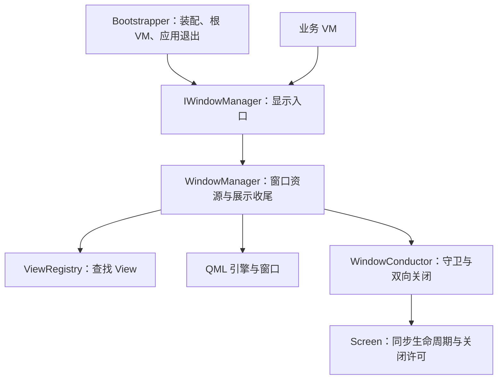

# 根窗口职责迁移可行性评估

2026-10-10。本文保留第一轮可行性验证时的分析与原型证据。随后已按用户要求落地第一步职责迁移，正式实现增加失败回收、借用对象失效处理和独立服务收尾，2026-10-11 已进一步将 attachToWindow / detachFromWindow 收为 private，取消外部窗口接入；本文原型中的外部窗口方案不再适用。当前契约见 [WindowManager](../WindowManager.md)，正式验证见 [职责迁移验收](../验收/根窗口职责迁移验收记录.md)。尚未暂存或提交。

## 结论与验证范围

可以把 `BootstrapperBase::DisplayRootView` 中的窗口创建移到 `IWindowManager::showWindow`，并把引擎、窗口关闭桥接和正常关闭后的 VM 停用交给 `WindowManager`。Bootstrapper 保留根工厂、根 VM 所有权、应用事件循环、退出钩子及启动失败/强制退出时的根生命周期兜底。

临时原型已完成构建，CTest **56/56 通过**，`all_qmllint` 通过。原型包含原有 54 个 CTest 入口、两个新增 Bootstrapper 场景，以及 WindowManagerTests 内一个新增普通窗口测试。

这证明当前单普通窗口及单弹窗约束下的职责迁移可行。原型保留“先激活 VM，再加载 View”的现有顺序，仅支持映射到 QQuickWindow 的普通窗口；没有验证完整 CM 行为、多普通窗口、普通 Item 的窗口包装或新的生命周期顺序。本次测试使用 offscreen/software，未执行实际窗口交互或麒麟验证。

## CM 3.2.0 的实际职责

本次直接读取了官方 `3.2.0` 标签源码，针对 WPF/NET 分支，不以新版异步接口或 Silverlight 根视图流程解释本项目。

- [Bootstrapper.cs](https://github.com/Caliburn-Micro/Caliburn.Micro/blob/3.2.0/src/Caliburn.Micro.Platform/Bootstrapper.cs)：NET 分支第 235—247 行，`DisplayRootViewFor` 获取 `IWindowManager`、解析 VM，再调用 `ShowWindow`，自身不创建窗口。
- [WPF WindowManager.cs](https://github.com/Caliburn-Micro/Caliburn.Micro/blob/3.2.0/src/Caliburn.Micro.Platform/net40/WindowManager.cs)：普通窗口分支调用 `CreateWindow(..., false, ...).Show()`；`ShowDialog` 调用同一创建入口再展示模态窗口。`CreateWindow` 定位 View、确保窗口包装、绑定 VM、应用设置并创建私有 WindowConductor；WindowConductor 激活 VM 并协调关闭守卫和双向关闭。

CM 在创建、绑定 View 后才激活 VM，最后显示窗口。它支持普通 View 包装成 Window，也保留已有 Window。Qt 当前根 View 必须直接是窗口；弹窗只包装 Item。这两项差异需要独立处理，不能把函数搬移视为全部对齐。

## 当前耦合与建议边界

| 位置 | 当前耦合 | 建议边界 |
| --- | --- | --- |
| Bootstrapper::DisplayRootView | 查询映射、激活、创建引擎、注入类型化 VM、加载 QML、校验窗口、关联弹窗所属窗口、创建桥接 | 委托 `showWindow` 并记录显示结果；窗口细节进入 WindowManager |
| Bootstrapper 资源成员 | 同时持有根 VM、引擎和 WindowConductor | 保留根 VM；引擎、窗口与桥接由窗口服务的私有资源记录持有 |
| WindowManager::attachToWindow | 依赖调用方先创建窗口，借用该窗口的 QML 引擎 | 保留外部窗口接入；`showWindow` 自己创建的资源必须与外部借用资源区分 |
| WindowConductor | 处理守卫、tryClose 和 VM 已关闭后的反向关窗；实际窗口关闭后通知调用方 | 继续作为私有桥接；正常关闭后的 VM 收尾由 WindowManager 处理，不回调 Bootstrapper 关闭根 |
| 普通窗口与弹窗收尾 | 根由 Bootstrapper 关闭，弹窗由 WindowManager 关闭，策略有所不同 | 服务内分别处理：普通窗口借用 VM，弹窗接管 VM 并交付 Future；共用守卫桥接，不强行统一结果和删除策略 |
| 应用退出 | Bootstrapper 直接停用桥接、解除宿主，再关闭根、执行 OnExit、释放引擎 | Bootstrapper 决定应用退出顺序；通过窗口服务清理入口完成窗口层操作 |
| VM 对服务的依赖 | 根及子 VM 持有 `shared_ptr<IWindowManager>` | 保留接口依赖；退出时显式释放窗口资源，不能只等待服务析构 |

Bootstrapper 仍可在装配时创建具体 WindowManager，并管理进程级 ViewRegistry 的配置冻结；这些属于装配职责。根 VM 的 CppOwnership 设置也属于对象所有权，无须为了去掉全部 Qt 引用而另加一层。业务 VM 继续只使用 IWindowManager，不持有窗口、引擎或 Bootstrapper。

建议调用方向：



## 临时原型实际做了什么

原型目录：`/private/tmp/cmqt-showwindow-feasibility`。相对本轮原工作区的差异：`/private/tmp/cmqt-showwindow-feasibility.patch`。临时目录不作为正式交付或长期保存位置。

1. 给 IWindowManager 增加 `bool showWindow(const QVariant &viewModel)`，具体实现位于 WindowManager。bool 保留当前 Qt 启动失败检查，是与 CM void 返回的适配差异。
2. 保留原始 QVariant 供 `required property ShellViewModel viewModel` 注入，仅从中借用 Screen 指针来查询映射及驱动生命周期。没有把传给 QML 的值统一退化成 ScreenViewModel 指针。
3. 用私有 ManagedWindow 持有 QQmlApplicationEngine 和 WindowConductor；Bootstrapper 移除这两个成员及相应直接依赖，DisplayRootView 只委托显示并记录结果。
4. WindowManager 在正常窗口关闭后执行 VM 关闭生命周期，记录已尝试关闭，防止业务直接关闭后的重复停用。异常在 Qt 回调边界捕获，通过清理失败通知让 Bootstrapper 保留原来的失败退出码。
5. 提供具体服务的 `prepareForShutdown` 与 `releaseWindows`，分别停用桥接/结束弹窗和释放窗口资源。它们是原型的退出协议，不要求原样成为最终公开 API。
6. 保留 Bootstrapper 的 CloseRoot，负责失败启动或强制应用退出时的兜底；它继续观察 attemptingDeactivation，已尝试过的关闭不重试。正常窗口关闭路径不再依赖 Bootstrapper。

服务只借用普通窗口 VM，不能把根 unique_ptr 移入服务。根和子 VM 持有共享窗口服务，若服务同时强持有根 VM，会形成所有权环。普通窗口资源和 VM 的寿命也不能简单绑定到共享服务的最终析构。

当前 `busy/currentDialog` 继续只表示弹窗状态；普通窗口打开不应使确认弹窗被判定为忙。当前单所属窗口的限制也仍存在，不能据此宣称已经支持任意多窗口。

## 必须保留的退出顺序

1. 停用普通窗口的关闭桥接，结束在途弹窗；弹窗窗口/View 释放且 Future 完成。
2. 对尚未尝试关闭的根 VM 执行关闭生命周期，捕获异常并保留错误状态。
3. 调用 OnExit；此时根 VM 与根 View 仍存活。
4. 事件循环返回后的最终清理中释放普通窗口桥接、View 和引擎。
5. 释放根 VM、工厂及 Bootstrapper 持有的服务引用。

第三步与第四步不能合并，否则会改变 OnExit 的既有可观察契约。第四步必须显式执行，即使外部仍持有窗口服务的 shared_ptr。

## 验证证据

原型构建与静态检查均通过。完整 CTest 用时约 4.66 秒，56/56 通过；涵盖既有启动失败、根关闭守卫、异常退出、弹窗与生命周期回归。

新增验证：

| 场景 | 验证结果 |
| --- | --- |
| 根 QML 设置 visible: false | showWindow 显式显示窗口，成功进入事件循环 |
| Run 返回后业务仍持有共享窗口服务 | 所有窗口仍被释放，根 VM 被删除，服务可继续存活；释放最后的共享引用后服务销毁 |
| 不经过 Bootstrapper 调用 IWindowManager::showWindow | 成功激活借用 VM；延后守卫拒绝时保留窗口和活动状态，放行后关闭并仅停用一次；释放窗口资源后 VM 仍由调用方持有 |

复验命令：

```sh
cd /private/tmp/cmqt-showwindow-feasibility
cmake --preset macos-local
cmake --build --preset macos-local -j 6
ctest --test-dir build/debug --output-on-failure -j 4
cmake --build build/debug --target all_qmllint
```

日志分别为 `/private/tmp/cmqt-showwindow-build-final.log`、`/private/tmp/cmqt-showwindow-ctest.log` 和 `/private/tmp/cmqt-showwindow-qmllint.log`。完整 Qt Test 输出在原型构建目录的 `Testing/Temporary/LastTest.log`。构建使用沙箱外执行，避免项目已知的 Qt 工具 NEON 检测问题；故意非法 QML 夹具的诊断仍为预期。

## 正式改造建议

第一步落地本次验证的窗口职责及所有权迁移，保留根工厂与应用退出契约；接口保持项目现有小驼峰命名 `showWindow`。避免把服务定位器、Bootstrapper 状态或 OnExit 回调塞进 WindowManager，也不增加主窗口专用业务逻辑。

第二步单独对齐 CM 的创建/绑定/激活/显示顺序，并统一普通窗口与弹窗内部的 CreateWindow/EnsureWindow 职责。先明确已有 Window 与 Item 包装的支持范围，再扩展实际需要的窗口选项；无需照搬 WPF NavigationWindow、Popup 或同步 ShowDialog。

时序变更必须补测：View 创建时 VM 尚未激活的绑定状态、创建失败时不误激活、激活异常清理、初次 ViewHost 装载、创建期 closeRequested，以及激活钩子内弹窗的所属窗口可用性。现有测试对加载失败后关闭生命周期的预期会随顺序改变，需要基于新契约调整，不能机械保留。窗口创建成功和实际显示成功也需要明确失败诊断；原型的简化 bool 诊断尚不是最终实现。

多普通窗口仍需要重新设计所属窗口选择和应用退出策略，不在本次可行性验证范围内。业务窗口服务可替换入口属于另一项装配扩展，本次职责迁移不以引入通用 IoC 容器为前提。
